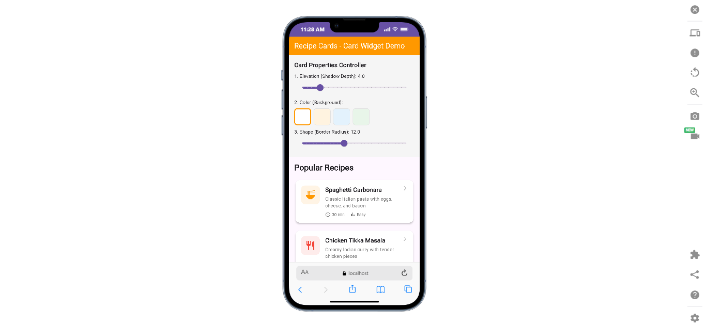

# Flutter Card Widget Demo (Recipe Cards)

This is my Flutter widget presentation project for the `Card` widget.  
I used a simple recipe list screen to show a practical use case where each recipe is displayed as a card.

## One-line Widget Description
The `Card` widget is a Material Design container used to group related content with elevation, color, and shape styling.

## Real-World Use Case
The app represents a recipe browsing list. Each recipe is shown inside a card with an icon, title, description, and quick metadata. This pattern is common in production apps for food content, products, notifications, and article previews.

## Three Card Properties Demonstrated

### 1) `elevation`
- **Default**: `1.0`
- **In this demo**: adjusted live from `0` to `16`
- **On-screen effect**: changes card shadow depth (flat to raised)
- **Why developers change it**: to create visual hierarchy and highlight important items

### 2) `color`
- **Default**: theme card color (usually white)
- **In this demo**: white, light orange, light blue, and light green options
- **On-screen effect**: changes card background color
- **Why developers change it**: to support branding and visual grouping/categorization

### 3) `shape`
- **Default**: rounded rectangle with small corner radius
- **In this demo**: corner radius adjusted live from `0` to `28`
- **On-screen effect**: cards shift from sharp-corner to rounded-corner style
- **Why developers change it**: to match the product’s visual style (formal vs friendly)

## Run Instructions

1. Clone the repository:
   ```bash
   git clone https://github.com/AnithaUwi/widget_presentation.git
   cd widget_presentation
   ```

2. Install dependencies:
   ```bash
   flutter pub get
   ```

3. Run the app:
   ```bash
   flutter run -d chrome
   ```

## Screenshot

Place the screenshot at `screenshots/demo_screenshot.png`.



## Tech Stack
- Flutter
- Dart
- Material Design widgets

## Presentation and Submission
- **Presentation Date**: March 9, 2026
- Presented in class with a live demo and code walkthrough of the `Card` widget.
- Public GitHub repository link submitted in Canvas.
